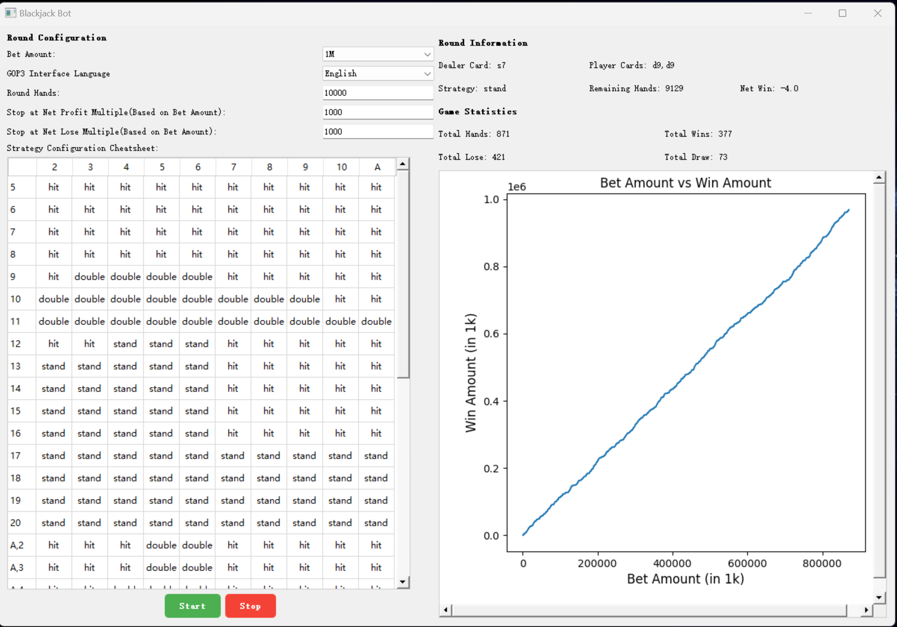

# GOP3 Blackjack Bot
This is a simple blackjack bot for the game "Governor of Poker 3". 
It uses `pyautogui` to take screenshots and click buttons, and `opencv` to recognize the cards and buttons.
Then it uses a [strategy configuration cheatsheet](./assets/cheatsheet.png) to decide the next move.
The `v2` tag is a quite stable version. From my serveral 1000 hands test, the expectation is around 0.99.
The main branch is for more features and improvements but I don't think the expectation will change much.


## Usage
1. Requirements in GOP3:
    - The game must be in fullscreen mode(1920*1080).
    - The game must be in English or Chinese([other language contributions are welcome!](https://github.com/lng2020/GOP3-blackjack-bot#Translation)).
    - The game must be in the personal blackjack room.
2. Run the bot:
```bash
pip install -r requirements.txt
python main.py
```
## TODO
- [x] Add i18n support(supported languages: English, Chinese)
- [ ] Self-defined strategy
- [ ] Adapt different resolutions
- [x] Better distinguish win/draw conditions
- [x] Better spliting cards recognition

## Known issues
1. if this hand contains more than 5 cards, the bot will not recognize the cards correctly.
2. the win/lose amount is not right after spliting cards.

## Translation
This is guide for translating the bot to other languages. If you want to contribute, please follow the steps below:
1. screenshot the game interface and save it to `image/{language_name}` folder. Required images are:
    - `hit.png`
    - `stand.png`
    - `double.png`
    - `split.png`
    - `win.png`
    - `lose.png`
    - `draw.png`
    - `blackjack.png`
    - `bust.png`
2. Add this language to the constants in `main.py`:
```python
SUPPORTED_LANGUAGE = ["English", "Chinese"]
LANGUAGE_MAP = {
    "English": "en-us",
    "Chinese": "zh-cn",
}
```

you can see the `image/zh-cn` folder for reference.
## Credits
https://github.com/weeeeeesterly/GOP3blackjack-21-